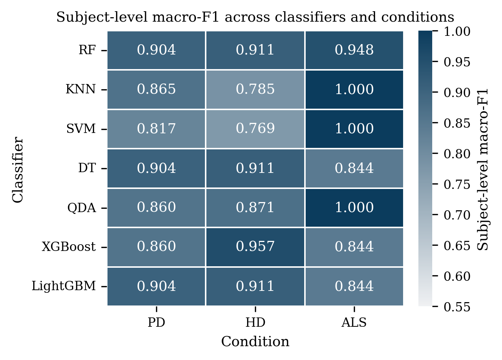
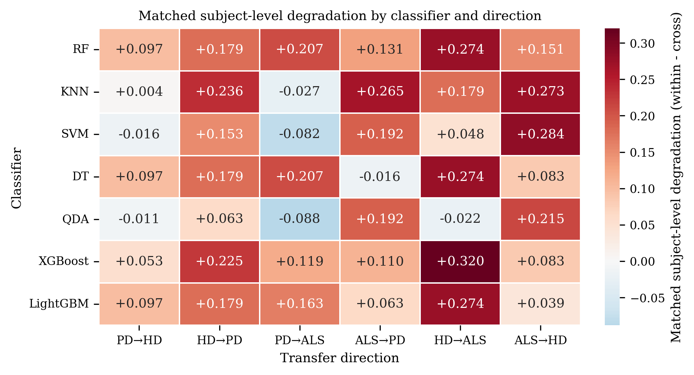
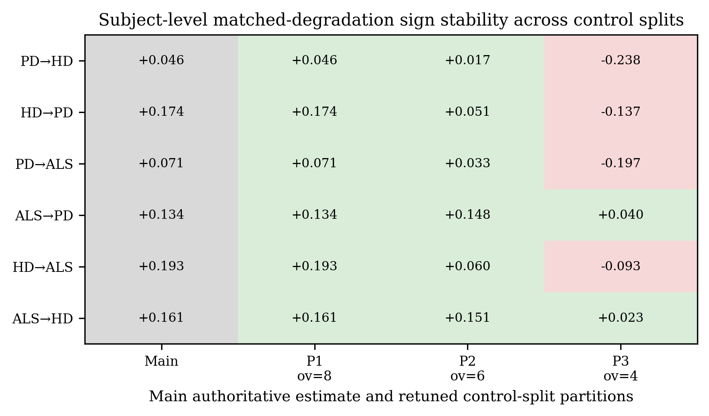

# Gait Transfer Across Neurological Conditions

**Does a disease-versus-control gait boundary learned on one neurological condition still work on another, with no retraining?** A leakage-controlled, subject-level benchmark of all six directed zero-shot transfers among Parkinson's disease, Huntington's disease, and ALS, with SHAP reliance-shift diagnostics, robustness testing, and control-partition sensitivity analysis.


---

## The question

Gait-timing classifiers routinely separate patients from healthy controls with high accuracy. That result says a boundary exists inside one cohort. It says very little about whether the boundary describes gait abnormality in general, or only the particular disease and the particular people it was fitted on.

This study asks the narrower question directly. Fit an abnormal-versus-control boundary on one condition, then apply it unchanged to a different condition, with no target labels, no retuning, no threshold selection, and no calibration. Whatever accuracy survives is the part of the learned boundary that was not specific to the source disease.

Getting a defensible answer is mostly a question of evaluation discipline. Strides from one subject are highly correlated, so any split that lets a subject appear on both sides inflates the score. Every abnormal-versus-control task also needs healthy controls on *both* sides, and these public cohorts are small enough that the same control subjects would normally appear in source training and target evaluation. A model could then score well simply by re-recognising healthy gait it had already seen. This benchmark controls both effects: evaluation is subject-level throughout, and the 16 healthy controls are split once into two disjoint pools before any task is defined.

**Headline result.** Strong within-condition performance did not guarantee portable performance. Averaged over seven classifier families, every one of the six directions lost accuracy relative to its own matched within-source baseline, while cross-condition signal remained clearly above chance. Transfer was asymmetric, depended on the classifier family, and proved sensitive to which healthy subjects were assigned to which control pool.

---

## Study at a glance

| | |
|---|---|
| **Dataset** | [PhysioNet Gait in Neurodegenerative Disease Database](https://physionet.org/content/gaitndd/1.0.0/) (GAITNDD) |
| **Conditions** | Parkinson's (PD), Huntington's (HD), ALS, plus healthy controls |
| **Usable subjects** | 63 (15 PD, 19 HD, 13 ALS, 16 control) |
| **Retained stride rows** | 13,765 of 15,160 raw |
| **Features** | 14 engineered timing features in 5 families |
| **Classifier families** | 7 (RF, KNN, SVM-RBF, decision tree, QDA, XGBoost, LightGBM) |
| **Directed transfer tasks** | 6 (every ordered disease pair) |
| **Transfer evaluations** | 42 (6 directions × 7 families) |
| **Primary endpoint** | Subject-level macro-F1 (stride-level reported as a companion) |
| **Uncertainty** | 10,000 subject-level bootstrap resamples; 10,000-draw subject-aware permutation tests |
| **Interpretability** | SHAP reliance shift (`δj`) between source and target pools |
| **Authoritative artifact line** | `v4` |

---

## Project status

The core study is complete. Every experiment behind the reported results has been run, frozen, and verified against stored manifests.

| Stage | Status |
|---|---|
| Cohort audit, filtering, and frozen feature matrix | Complete |
| Disjoint control partitioning | Complete |
| Within-condition benchmark (nested subject-level LOSO) | Complete |
| Six-direction zero-shot transfer benchmark | Complete |
| SHAP reliance-shift (`δj`) diagnostics | Complete |
| Robustness: noise, structured corruption, permutation sensitivity | Complete |
| Uncertainty: subject-level bootstrap and permutation inference | Complete |
| Control-partition sensitivity (three balanced partitions) | Complete |
| Unsupervised subject-level geometry (PCA, K-means) | Complete |
| Publication figures, tables, and manuscript draft | Complete |
| Artifact freezing, manifests, and verification suite | Complete |
| Interactive demo app migrated to the `v4` artifacts | Outstanding (still reads the superseded `v2` line) |
| External validation on an independent cohort | Open research extension |

Remaining items are follow-up work and research extensions, listed in the [Roadmap](#roadmap). They are not gaps in the main experiments.

---

## What this repository contributes

| Contribution | Detail |
|---|---|
| **Subject-level benchmark** | Outer leave-one-subject-out evaluation with grouped inner selection; subject-level macro-F1 is the primary endpoint, not stride-level accuracy |
| **Zero-shot transfer design** | All six directed disease-to-disease transfers, each applying a fitted source model once to an unseen condition |
| **Leakage control** | No subject ever spans training and evaluation; SMOTE is confined to training folds; the held-out subject is never seen during tuning |
| **Disjoint healthy controls** | Control A trains, Control B scores, so both sides of the comparison change under transfer |
| **Matched degradation** | Each family is compared against *its own* within-condition estimate, not against the source condition's best model |
| **Reliance-shift diagnostic** | SHAP `δj` measures how a model's feature reliance moves when it crosses a disease boundary |
| **Robustness suite** | Gaussian feature-space stress, five structured corruption families, single-feature and joint-family permutation, per-subject sensitivity |
| **Partition sensitivity** | The full protocol is re-run under two alternate, equally balanced control partitions |
| **Reproducible artifacts** | Protocol, preprocessing, and execution manifests with hashes; every reported number traces to a stored result file |

---

## Pipeline

```text
                 PhysioNet GAITNDD  (64 subjects, 15,160 stride rows)
                             |
              plausibility screen + subject-wise robust filter
                             |
          frozen matrix: 63 subjects, 13,765 strides, 14 features
                             |
        controls split once -> Control A (train) | Control B (score)
                             |
        +--------------------+---------------------+
        |                                          |
  WITHIN-CONDITION                          ZERO-SHOT TRANSFER
  disease + Control A                       full-source refit per family
  nested subject-level LOSO                 applied unchanged to
  grouped inner selection                   target disease + Control B
  (macro-F1, log-loss tie-break)            6 directions x 7 families
        |                                          |
        +--------------------+---------------------+
                             |
              matched degradation   dF1 = within - cross
                    (same family on both sides)
                             |
        +--------------------+---------------------+---------------------+
        |                    |                     |                     |
   SHAP reliance        robustness &          subject-level         control-partition
   shift (delta_j)      corruption suite      bootstrap +           sensitivity
   family movement      (stride-level)        permutation           (3 balanced splits)
        |                    |                     |                     |
        +--------------------+---------------------+---------------------+
                             |
                  figures, tables, manuscript
```

---

## Dataset and cohort

The study uses the PhysioNet GAITNDD database, one stride-timing series per subject derived from force signals recorded under each foot. **Raw data is not redistributed here.** Download it from PhysioNet and place it at:

```text
data/raw/gait-in-neurodegenerative-disease-database-1.0.0/
```

Two filtering stages run before any task is defined:

1. **Plausibility screen.** Removes non-positive durations, negative double-support time, stride durations above 3.0 s, and percentages outside `[0, 100]`. This leaves 14,751 rows and eliminates every stride of one HD subject, reducing the usable HD cohort from 20 to 19.
2. **Subject-wise robust filter.** Retains strides within three scaled median absolute deviations of each subject's median on left stride, right stride, and double-support time. It is skipped for any subject it would reduce below 100 strides, which occurred once. This removes a further 986 rows.

| Group | Subjects | Stride rows |
|---|---:|---:|
| PD | 15 | 3,414 |
| HD | 19 | 4,280 |
| ALS | 13 | 2,285 |
| Controls | 16 | 3,786 |
| &nbsp;&nbsp;Control A (source pools) | 8 | 1,934 |
| &nbsp;&nbsp;Control B (target pools) | 8 | 1,852 |
| **Total** | **63** | **13,765** |

**Stride level versus subject level.** Models consume stride rows, but strides within a subject are not independent, so every headline metric is computed after averaging each subject's predicted probabilities into one decision per subject. Stride-level scores appear only as a companion, and the stride-level diagnostics are labelled as such and never compared directly against the subject-level benchmark.

The 14 features span five families: 7 raw timing durations, 3 phase percentages, 1 stride asymmetry index, 2 coefficients of variation, and 1 detrended fluctuation exponent. The last three are computed once per subject and repeated on that subject's rows, which matters when interpreting the diagnostics.

---

## Leakage control and evaluation

This is the part of the design that makes the transfer numbers worth reading.

- **Why not random stride splits.** A subject contributes hundreds of correlated strides. Splitting rows at random puts near-duplicates of the test data into training and produces scores that say more about subject identity than about disease.
- **Outer loop.** Leave-one-subject-out. All strides of the held-out subject are withheld, and that subject is never seen during tuning.
- **Inner loop.** Candidate selection happens entirely inside the outer training pool with a grouped inner LOSO loop. Inner predictions are pooled across all held-out inner subjects before candidates are ranked, so one small fold cannot decide the selection.
- **Selection rule.** Pooled subject-level macro-F1, ties broken by lower subject log loss and then a deterministic ordering.
- **Healthy controls.** Control A appears only in source pools; Control B only in target evaluation. Both the disease cohort and the control pool change under transfer, which makes the setting zero-shot for both classes.
- **Resampling.** SMOTE is applied inside the training portion of a split only. Control A is the minority class in every source pool, so it synthesises healthy strides, never disease strides. It is one of three candidate imbalance arms, chosen by the selector rather than fixed in advance.

---

## Zero-shot transfer design

Six directed tasks, one fitted model each:

```text
PD  -> HD      HD  -> PD      PD  -> ALS
ALS -> PD      HD  -> ALS     ALS -> HD
```

After the within-condition analysis completes, each classifier family receives **one further grouped selection and refit on its complete source pool**, and that model is applied to the target pool exactly once.

**Retrained on the target:** nothing. No target labels, hyperparameters, decision thresholds, or calibration sets enter model construction at any stage.

Transfer cost is reported as **matched degradation**, `ΔF1 = F1_within − F1_cross`, where both terms belong to the *same* classifier family. A positive value means the model did worse on the unseen condition than within its own. Comparing against the source condition's single best model instead would conflate transfer loss with the choice of classifier.

---

## Results snapshot

### Within-condition baselines

Leading family per source task, subject-level macro-F1 under nested LOSO:

| Source task | Leading family | Subject macro-F1 | Stride macro-F1 | Imbalance arm |
|---|---|---:|---:|---|
| PD | Decision tree | 0.9042 | 0.9022 | class weighting |
| HD | XGBoost | 0.9571 | 0.9546 | none |
| ALS | QDA | 1.0000 | 0.9642 | SMOTE |

The surface is broad rather than a single lucky model: six of seven families exceed 0.85 on PD, five on HD, and three reach 1.0000 on ALS. Every family carries its own baseline into the transfer comparison.



### Zero-shot transfer

| Direction | Mean subject F1 | Mean ΔF1 | Best observed family | Best F1 | Best ΔF1 |
|---|---:|---:|---|---:|---:|
| PD → HD | 0.8278 | +0.0458 | QDA | 0.8712 | −0.0112 |
| HD → PD | 0.7003 | +0.1735 | QDA | 0.8083 | +0.0629 |
| PD → ALS | 0.8023 | +0.0714 | QDA | 0.9481 | −0.0881 |
| ALS → PD | 0.7920 | +0.1339 | Decision tree | 0.8600 | −0.0156 |
| HD → ALS | 0.6812 | +0.1925 | QDA | 0.8929 | −0.0216 |
| ALS → HD | 0.7649 | +0.1610 | LightGBM | 0.8052 | +0.0392 |

Means are unweighted averages over the seven families. The "best observed family" is identified **after** scoring the target, so it describes the best outcome among the families evaluated and is not a selection rule anyone could apply without target labels.

What the table supports:

- **Transfer degrades but does not collapse.** All six direction means are positive, and mean subject-level macro-F1 stays between 0.6812 and 0.8278.
- **Individual models can still cross cleanly.** 7 of the 42 classifier-direction pairs scored *above* their own within-condition baseline; five of those come from PD-source directions.
- **In-domain rank does not predict portability.** HD produced the second strongest within-condition leader yet the two weakest transfer directions on average. QDA led only the ALS source task but was the best observed family in four of six directions.
- **Transfer is asymmetric.** PD → HD degrades far less than HD → PD (+0.0458 against +0.1735), and the same ordering holds for the PD/ALS pair.
- **Uncertainty is wide.** 33 of 42 permutation tests fall below 0.05 (unadjusted, and dependent through the reused Control B pool), but the median subject-level 95% bootstrap interval spans 0.3623, so close directions should not be separated on rank alone.



---

## Reliance-shift diagnostics (SHAP)

The diagnostic question is not "which feature matters?" but **"where does the model's reliance move when it crosses a disease boundary?"**

For each fitted source model, mean absolute SHAP magnitudes are computed on the source pool and on the target pool, and compared feature by feature:

```text
delta_j = | mean|SHAP_j| on source  -  mean|SHAP_j| on target |
```

A normalised variant divides by within-source reliance (floored and capped) so that lightly used features do not dominate, and family-level movement sums the absolute per-feature changes so that a rise in one feature cannot cancel a fall in another.

Verified findings:

- **Family ordering.** Variability (0.0317) and raw timing (0.0314) carry the largest aggregate movement, ahead of fractal structure (0.0124), phase percentage (0.0052), and asymmetry (0.0031).
- **Most displaced cue.** The stride-time coefficient of variation appears among the three largest raw shifts in 33 of the 42 pairs, followed by the swing-time CV (21) and the fluctuation exponent (19). No single feature dominates the benchmark.
- **Movement does not explain loss.** The correlation between a model's largest normalised shift and its matched degradation is weak (Spearman ρ ≈ −0.204). Models can hold their score while their reliance moves, or lose accuracy without a dramatic shift.

These are statements about model behaviour on this feature representation. They are not causal claims about gait physiology, and attribution over mechanically linked timing features can divide credit among correlated variables.

---

## Robustness and sensitivity

All robustness diagnostics score stride rows directly and are reported as stride-level macro-F1.

| Analysis | Setup | Outcome |
|---|---|---|
| **Gaussian stress** | σ up to 0.50 of pooled source-target feature SD, 30 repetitions | HD-source directions weakest at σ = 0.50 (0.5818, 0.5992); PD → ALS most resilient (0.7119). QDA declines most steeply in every direction |
| **Structured corruption** | 5 families × 3 severities | At the heaviest setting: label corruption most damaging (0.6384), then jitter (0.6624) and gain/bias drift (0.6874); row dropout least (0.7453) |
| **Permutation sensitivity** | single-feature and joint-family, on the target pool | Variability and raw timing dominate under both aggregations |
| **Per-subject sensitivity** | stride accuracy per evaluated subject | Errors concentrate in a minority of subjects rather than spreading evenly |
| **Uncertainty** | 10,000 subject-level bootstrap resamples; 10,000-draw subject-aware permutations | Intervals are wide; rankings are descriptive |
| **Control-partition sensitivity** | full protocol re-run under 3 equally balanced partitions | See below |

**The control partition is a first-order factor.** All three partitions tie on the age and gait-speed balance criterion, so neither alternate is a worse split. The partition sharing six of eight Control A subjects with the main one preserves all six direction signs; the partition sharing four of eight reverses four of them. Decomposing that reversal shows most of the change comes from the *within-condition* side: with a different Control A group, the PD and HD source tasks themselves became harder, so the matched baselines dropped.



With eight healthy subjects per pool, who lands in which pool moves the estimate about as much as the choice of transfer direction. Results on cohorts this size should name their partition.

---

## Repository layout

```text
gait-transfer-ndd/
├── src/                         # research library (import with PYTHONPATH=src)
│   ├── preprocessing.py         # loading, filtering, control partitioning
│   ├── features.py              # 14-feature matrix, subject-level descriptors
│   ├── train.py                 # nested LOSO, grouped selection, transfer
│   ├── explain.py               # SHAP, delta_j, family movement
│   ├── robustness.py            # noise, corruption, permutation, sensitivity
│   ├── v4_downstream.py         # execution context, manifest validation
│   └── v4_provenance.py         # hashing and provenance helpers
├── scripts/
│   ├── setup/                   # protocol + execution manifest freezing
│   ├── training/                # *_modal.py (v4 line) and *_local.py (v3 line)
│   └── verification/            # 33 contract, identity, and replay checks
├── notebooks/                   # 00-08, analysis and figure generation (v4)
├── data/processed/v4/           # frozen feature matrices, partition, manifests
├── experiments/results/v4/      # authoritative result envelopes
├── report/
│   ├── figures/v4/{pdf,png}/    # figures by stage
│   ├── tables/v4/               # manuscript-facing CSV/TeX summaries
│   └── main.tex, main.pdf       # manuscript
├── app/app.py                   # Streamlit research demo
├── CONTRIBUTING.md, PROGRESS.md, LICENSE
└── requirements.txt, requirements-core.txt
```

**Artifact versions.** `v1`, `v2`, and `v3` directories are earlier experiment lines, retained for provenance. **`v4` is the authoritative line** and the only one behind the current results. The methodology was audited and repaired between these lines: inner selection moved from per-fold scoring to pooled subject-level scoring, imbalance handling became part of the grouped candidate space, transfer models are retuned on the full source pool instead of reusing modal fold parameters, permutation inference became subject-aware, and SHAP backgrounds became source-specific and class-balanced. Earlier numbers in older directories reflect the superseded protocol.

Model binaries (`.joblib`), SHAP caches, and run logs are generated locally and excluded from version control by size; the processed matrices, result envelopes, figures, and tables are committed.

---

## Reproducing the study

**Requirements:** Python 3.12.

```bash
python3.12 -m venv venv
source venv/bin/activate
pip install -r requirements-core.txt     # or requirements.txt for the full pinned set
```

### Start from the frozen artifacts (recommended)

Every reported number is committed. To inspect results without recomputation, read `experiments/results/v4/` and `report/tables/v4/`, or open notebooks `02`–`08`, which are wired to the `v4` artifacts and regenerate the figures and tables from stored envelopes.

```bash
jupyter lab notebooks/03_cross_condition.ipynb
```

### Rebuild the feature matrix

With raw GAITNDD data in place, the matrix rebuild is local and cheap. Note that `src/` modules import each other flat, so put `src` on the path:

```bash
PYTHONPATH=src python -c "from features import build_feature_matrix; build_feature_matrix()"
```

This writes `data/processed/v4/gait_features_v4.csv` plus the partition and preprocessing manifest.

### Re-run the experiments

The authoritative `v4` results were produced on [Modal](https://modal.com); the training sweeps are too heavy for a laptop. Each runner exposes `--action submit | status | assemble`:

```bash
modal run scripts/training/run_preprocessing_modal.py            --action submit
modal run scripts/training/run_within_condition_modal.py         --action submit
modal run scripts/training/run_cross_condition_modal.py          --action submit
modal run scripts/training/run_shap_modal.py                     --action submit
modal run scripts/training/run_noise_robustness_modal.py         --action submit
modal run scripts/training/run_control_split_sensitivity_modal.py --action retune-submit-within
```

The `*_local.py` runners in the same directory target the earlier **v3** line and are useful for local experimentation, but they do not reproduce the `v4` artifacts.

### Verify

The verification suite checks artifact identity, envelope schemas, runner contracts, and notebook wiring against the frozen manifests:

```bash
python scripts/verification/test_v4_artifact_identity.py
python scripts/verification/test_v4_downstream_final_envelopes.py
python scripts/verification/test_v4_static_contracts.py
python scripts/verification/test_v4_authoritative_runner_contracts.py
python scripts/verification/test_v4_notebook_contracts.py
```

### Demo app

```bash
streamlit run app/app.py
```

The app exposes within-condition inference, transfer inspection, and a noise sweep over stored predictions. **It currently reads the earlier artifact line, not `v4`**, so its numbers do not match the results above. Migrating it is the main outstanding engineering task.

---

## Where the current evidence lives

| Looking for | Path |
|---|---|
| Frozen feature matrix and partition | [`data/processed/v4/`](data/processed/v4/) |
| Protocol / preprocessing / execution manifests | [`v4_protocol_manifest.json`](data/processed/v4/v4_protocol_manifest.json), [`preprocessing_manifest_v4.json`](data/processed/v4/preprocessing_manifest_v4.json) |
| Within-condition results | [`pd_results_v4.json`](experiments/results/v4/pd_results_v4.json), `hd_…`, `als_…` |
| Zero-shot transfer results | [`cross_condition_results_v4.json`](experiments/results/v4/cross_condition_results_v4.json) |
| SHAP and `δj` | [`shap_results_v4.json`](experiments/results/v4/shap_results_v4.json) |
| Robustness and sensitivity | [`noise_robustness_v4.json`](experiments/results/v4/noise_robustness_v4.json), [`corruption_robustness_v4.json`](experiments/results/v4/corruption_robustness_v4.json), [`feature_sensitivity_v4.json`](experiments/results/v4/feature_sensitivity_v4.json), [`subject_sensitivity_v4.json`](experiments/results/v4/subject_sensitivity_v4.json) |
| Control-partition sensitivity | [`control_split_sensitivity/`](experiments/results/v4/control_split_sensitivity/) |
| Subject-level geometry | [`step6_subject_views_summary.json`](experiments/results/v4/step6_subject_views_summary.json) |
| Manuscript tables | [`report/tables/v4/`](report/tables/v4/) |
| Figures | [`report/figures/v4/`](report/figures/v4/) |

---

## Manuscript

The long-form manuscript source and compiled draft live at [`report/main.tex`](report/main.tex) and [`report/main.pdf`](report/main.pdf). Every quantitative claim in it is traceable to a stored `v4` result file.

The conference manuscript has been **submitted to ICACS'27 and is currently under review**; the long-form manuscript remains a working preprint draft. Neither version has been accepted or published, and nothing here should be read as a publication claim.

---

## Roadmap

### Completed

- [x] Cohort audit, dual-stage filtering, and frozen 63-subject feature matrix
- [x] Fourteen-feature timing representation with documented family structure
- [x] Disjoint Control A / Control B partitioning fixed before any task definition
- [x] Within-condition benchmark for 7 families across 3 conditions under nested subject-level LOSO
- [x] Methodology repair pass: pooled inner selection, imbalance arms inside the candidate space, full-source transfer refits, subject-aware inference
- [x] Six-direction zero-shot transfer benchmark, 42 evaluations, matched per-family degradation
- [x] SHAP reliance-shift diagnostics with source-specific class-balanced backgrounds
- [x] Robustness suite: Gaussian stress, 5 corruption families, marginal and joint permutation, per-subject sensitivity
- [x] Uncertainty: subject-level bootstrap intervals and subject-aware permutation tests
- [x] Control-partition sensitivity across three equally balanced partitions
- [x] Unsupervised subject-level PCA and K-means geometry
- [x] Publication figures, manuscript tables, and a complete manuscript draft
- [x] Frozen manifests, hash provenance, and a verification suite over the stored artifacts

### Remaining engineering

- [ ] Migrate the Streamlit app from the legacy artifact line to `v4`
- [ ] Refresh `PROGRESS.md`, whose entries stop before the `v4` line
- [ ] Regenerate the few notebook figures that still use the superseded family-aggregation convention
- [ ] Assemble the final preprint source package

### Research extensions

- [ ] External validation on an independent gait cohort, and additional neurological conditions
- [ ] A model-selection rule that never reads target labels, separating source-only from transductive variants
- [ ] Richer representations (raw timing sequences, force waveforms, kinematics, wearables) to test how much fragility is a representation bottleneck
- [ ] Domain adaptation and domain generalisation baselines built for cross-condition shift
- [ ] Held-out, shift-aware calibration; the conformal analysis in the repository is exploratory and is deliberately excluded from the reported evidence

---

## Limitations

- **Small where it counts.** 63 subjects, and target evaluation pools of 21 to 27. One subject can move a score noticeably, and the thousands of stride rows do not reduce subject-level uncertainty.
- **Single dataset.** One public cohort, no external validation, so the conclusions are specific to GAITNDD.
- **Control balance is internal.** Control A and Control B are balanced against *each other* on age and gait speed. Neither is demographically matched to the disease cohorts, so part of any abnormal-versus-control boundary may track age or speed rather than disease.
- **Partition dependence.** Direction-level signs are not invariant to the healthy-control assignment, which is reported rather than averaged away.
- **Feature dependence.** Raw timing variables are mechanically linked and phase percentages are compositional, so single-feature readings inside a family are weak. The fluctuation exponent comes from a filtered, gapped stride series and is a pragmatic descriptor.
- **Interpretability is not causality.** SHAP movement describes model reliance, not disease mechanism.
- **Retrospective leaders.** The best-performing family in each direction was identified using target labels and does not constitute an operational selection rule.
- **Not clinical.** Nothing here is validated for diagnosis.

---

## Authors and collaboration

A two-person undergraduate research project by **Ahmad Shahmeer** and **Ali Aqdas** (School of Electrical Engineering and Computer Science, NUST). The work was divided across the pipeline stages, with the development history recorded in [`PROGRESS.md`](PROGRESS.md). [`CONTRIBUTING.md`](CONTRIBUTING.md) documents the methodological rules a change has to respect. Contributions that improve reproducibility, statistical rigour, or methodological clarity are welcome.

---

## Disclaimer and license

**For research and educational use only.** This is not a medical device and not a diagnostic tool. Nothing in this repository should inform clinical decisions without substantial independent validation. The dataset is a small public research cohort, and the findings are exploratory.

Released under the [MIT License](LICENSE). The GAITNDD data remains subject to [PhysioNet's own terms](https://physionet.org/content/gaitndd/1.0.0/).
