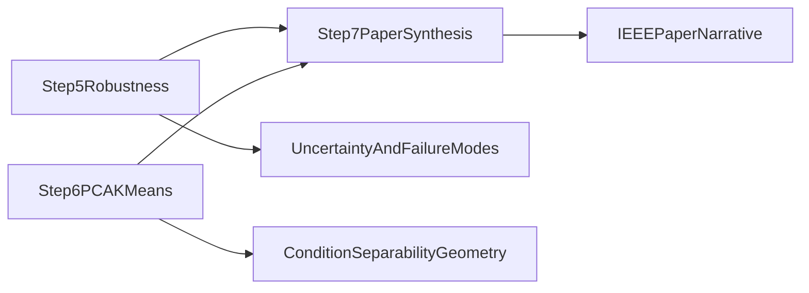
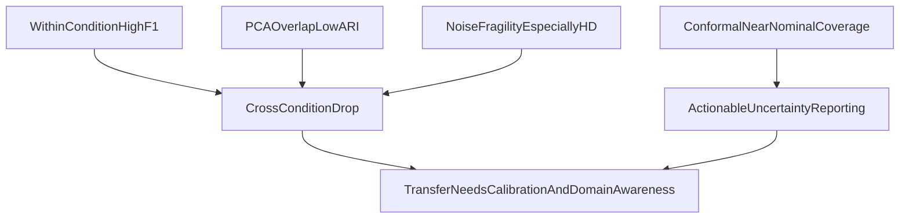

# Step 5-6-7 Interpretation (v2)

This note summarizes the current interpretation of the latest v2 outputs for:

- Step 5: robustness + sensitivity (`experiments/results/v2/*_v2.json`)
- Step 6: PCA separability + unsupervised clustering
- Step 7: final paper figures/tables

---

## 1) End-to-end picture

- Step 5 tells us how stable models are under perturbations and where they fail.
- Step 6 tells us whether the feature space naturally separates conditions.
- Step 7 fuses both into manuscript-ready visual claims.

---

## 2) Step 5 interpretation (robustness + sensitivity)

### 2.1 Gaussian noise robustness (sigma sweep)

Using `noise_robustness_v2.json`, clean vs noisy (`sigma=0.5`) behavior is:

- **PD:** moderate degradation for most models; largest drops in QDA and LGBM.
  - Example: RF `0.820 -> 0.754` (drop `0.066`), QDA drop `0.175`.
- **HD:** strongest fragility overall.
  - Example: XGB `0.956 -> 0.677` (drop `0.279`), RF drop `0.273`, DT drop `0.267`.
- **ALS:** comparatively more stable for KNN/LGBM, less stable for QDA/XGB.
  - Example: KNN drop `0.011`, LGBM drop `0.011`, QDA drop `0.192`.

Interpretation:

- HD classifiers appear most sensitive to broad additive perturbations.
- QDA is consistently the least robust under heavy noise.
- KNN is notably stable for ALS in this feature regime.

### 2.2 Feature sensitivity (permutation drops)

From `feature_sensitivity_v2.json`, mean permutation effects differ by cohort:

- **HD** has clearly positive top drops, with `double_support_pct` and `cv_swing` near top.
- **PD/ALS** include many near-zero or negative mean drops.

Important caveat:

- Negative permutation values do **not** mean the feature is “good to shuffle.”
- They indicate small-sample/model-variance effects where permutation can occasionally improve F1 on a specific evaluation draw.
- Interpretation should focus on consistent positive and large-magnitude effects across classifiers/directions.

### 2.3 Conformal coverage

From `conformal_v2.json` (LAC, alpha=0.10, mean over classifiers):

- PD coverage: ~`0.899`
- HD coverage: ~`0.913`
- ALS coverage: ~`0.898`

Interpretation:

- Coverage is close to nominal `0.90`, which supports reliable uncertainty calibration in within-condition settings.
- Use conformal set size and stride aggregation curves to report confidence-vs-data tradeoff in clinical wording.

### 2.4 Step 5 figures to cite

- `report/figures/v2/pdf/fig6_noise_robustness.pdf`
- `report/figures/v2/png/fig6_noise_robustness.png`

---

## 3) Step 6 interpretation (PCA + unsupervised clustering)

### 3.1 Quantitative clustering alignment

From `report/tables/v2/pca_kmeans_ari_summary.csv`:

- `ARI (K=3 vs condition)` = `0.0338`
- `ARI (K=6 vs condition x label)` = `0.1678`

Interpretation:

- Condition labels are **not** strongly recovered by unsupervised K=3 clustering.
- Adding disease/control granularity (K=6 target) improves alignment, but still indicates substantial overlap.
- This supports a “partially separable, clinically entangled manifolds” narrative.

### 3.2 Visual geometry message

Use these updated Step 6 plots:

- `report/figures/v2/png/pca_scatter_by_condition.png`
- `report/figures/v2/png/pca_feature_loadings.png`
- `report/figures/v2/png/kmeans_elbow.png`
- `report/figures/v2/png/kmeans_silhouette.png`
- `report/figures/v2/png/kmeans_scatter_k3.png`

Suggested paper wording:

- “PCA exposes broad condition tendencies but with strong inter-condition overlap.”
- “Unsupervised clusters do not map one-to-one to condition labels, implying that transfer degradation is not solely due to linear separability.”

---

## 4) Step 7 interpretation (paper-level synthesis)

From `report/tables/v2/master_results.csv`:

- 42 direction-classifier rows
- Mean within F1: `0.8001`
- Mean cross F1: `0.7403`
- Mean delta F1: `-0.0598`

Worst transfer degradations include:

- `HD→ALS` with RF: `0.9530 -> 0.6788` (delta `-0.2742`)
- `HD→PD` with RF: `0.9530 -> 0.7252` (delta `-0.2278`)
- `HD→ALS` with XGB: delta `-0.2188`

Interpretation:

- Transfer degradation is real and asymmetric.
- Strong within-condition performance does not guarantee transfer stability.
- This aligns with Step 6’s overlap finding and Step 5’s robustness stress results.

### Step 7 figures to cite

- `report/figures/v2/pdf/fig3_cross_degradation.pdf`
- `report/figures/v2/pdf/fig4_shap_delta_j.pdf`
- `report/figures/v2/pdf/fig5_pca_kmeans.pdf`
- `report/figures/v2/pdf/fig6_noise_robustness.pdf`

---

## 5) Recommended IEEE narrative integration

- **Core claim:** accuracy is strong in-domain, but transfer is constrained by distribution shift and robustness limits.
- **Support stack:**
  - Step 6 (geometry): overlap and weak unsupervised alignment.
  - Step 5 (stress tests): direction/cohort-dependent fragility.
  - Step 7 (integrated table/figures): quantifies asymmetric degradation.
- **Clinical framing:** retain calibrated uncertainty reporting (conformal), especially in cross-condition inference.

---

## 6) File map (for quick manuscript edits)

- Step 5 data: `experiments/results/v2/noise_robustness_v2.json`, `feature_sensitivity_v2.json`, `subject_sensitivity_v2.json`, `corruption_robustness_v2.json`, `conformal_v2.json`
- Step 6 tables: `report/tables/v2/pca_kmeans_ari_summary.csv`, `pca_kmeans_ct_k3_vs_condition.csv`, `pca_kmeans_ct_k6_vs_condition_label.csv`
- Step 7 table: `report/tables/v2/master_results.csv`
- Paper-ready figures: `report/figures/v2/pdf/fig3_cross_degradation.pdf`, `fig4_shap_delta_j.pdf`, `fig5_pca_kmeans.pdf`, `fig6_noise_robustness.pdf`

